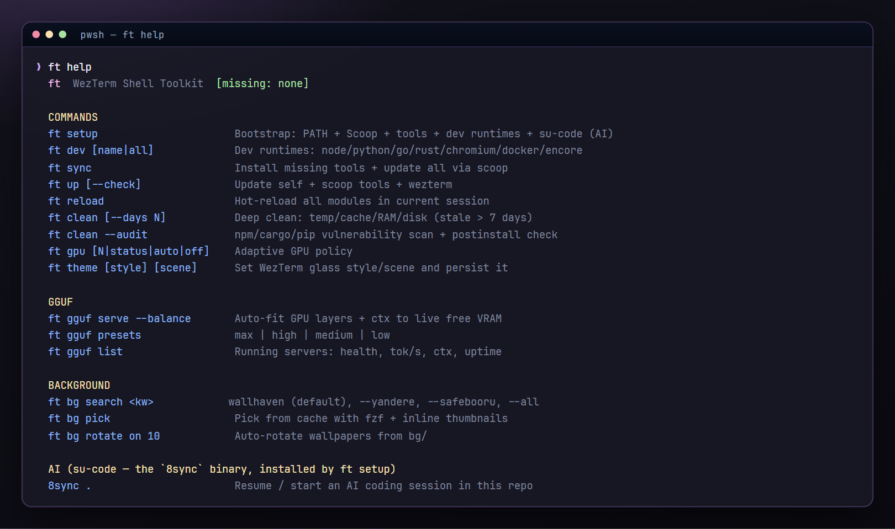
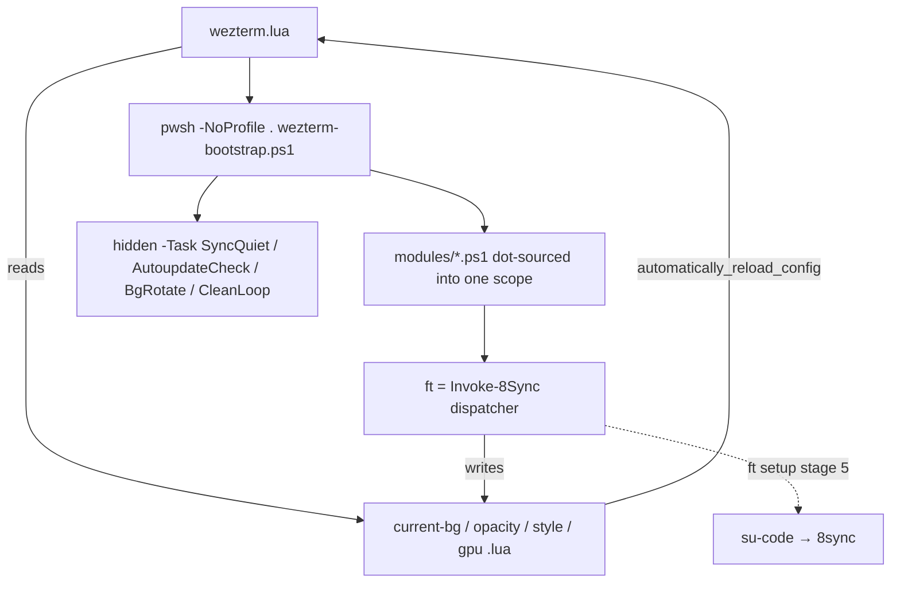

<div align="center">


<h1>⚡ flash-term</h1>

**The Windows 11 terminal that looks unreal — and installs your entire dev world with one command.**

WezTerm config + the `ft` command: Catppuccin glass, live wallpapers, 21 CLI tools, 7 dev runtimes
with **zero Visual Studio**, a local GGUF LLM server, and an AI coding harness one keystroke away.

[](https://www.microsoft.com/windows)
[](https://wezfurlong.org/wezterm/)
[](https://learn.microsoft.com/powershell/)
[](https://github.com/catppuccin/catppuccin)
[](#-toolchain--21-cli-tools-7-runtimes-0-visual-studio)
[](LICENSE)

**English** · [Tiếng Việt](README.vi.md) · [Website](https://8-sync-dev.github.io/flash-term/) · [Keybindings](docs/KEYBINDINGS.md) · [Architecture](docs/ARCHITECTURE.md)

```powershell
irm https://8-sync-dev.github.io/flash-term/install.ps1 | iex
```

</div>

---

## Why flash-term

Windows terminals ask you to choose: **pretty** or **powerful**. flash-term refuses.

- 🪟 **Looks unreal, stays readable.** 3 glass styles × 3 scenes = 9 persisted looks, a 4px neon border,
  Mica backdrop, and an overlay that reads your wallpaper's own luminance (Rec.709) so text never drowns.
- 🚀 **One command owns your machine setup.** `ft setup` goes bare-Windows → Scoop, WezTerm, Nerd Font,
  PowerShell 7, 21 CLI tools, 7 dev runtimes, AI harness. **No Visual Studio build tools. Ever.**
- 🧠 **AI-ready, AI-honest.** flash-term ships no AI logic. It installs [su-code](https://github.com/8-Sync-Dev/su-code)
  (the `8sync` command) and can serve your **own** GGUF model over an OpenAI-compatible `/v1` endpoint.
- ⏱ **Fast on purpose.** Startup is timed per phase, ring-buffered, and shown in `ft status`
  (`startup perf: last=467.9ms`). Caches, gates, and deferred prompt init exist because milliseconds were measured.

<div align="center">



</div>

## ⚡ Install

**One-liner** (PowerShell):

```powershell
irm https://8-sync-dev.github.io/flash-term/install.ps1 | iex
```

…or with `curl`:

```sh
curl -fsSL https://raw.githubusercontent.com/8-Sync-Dev/flash-term/main/install.ps1 | pwsh -
```

Re-run it anytime to **update** (it fetches and hard-resets to `origin/main` — keep local edits out of
`~/.config/wezterm`, or use `ft up self` which stashes them for you).

| Flag | Effect |
|---|---|
| `-ConfigDir <path>` | Install somewhere other than `%USERPROFILE%\.config\wezterm` |
| `-Update` | Pull only, skip `ft setup` |
| `-NoSetup` | Config only — no Scoop, no tools, no runtimes |
| `-Branch <name>` / `-Repo <url>` | Track a different branch or fork |

**From source:**

```powershell
git clone https://github.com/8-Sync-Dev/flash-term.git "$env:USERPROFILE\.config\wezterm"
pwsh -NoProfile -Command ". $env:USERPROFILE\.config\wezterm\wezterm-bootstrap.ps1 -Task Status; Invoke-SetupCommand"
```

The installer clones, then runs **`ft setup`** — 5 labelled stages, every one skippable
(`--no-tools`, `--no-dev`, `--no-harness`, `--check`):

```
[1/5] core tools on PATH        git · omp · wezterm resolution
[2/5] Scoop                     + WezTerm, JetBrainsMono NF, PowerShell 7, CompletionPredictor
[3/5] managed tools             21 CLI tools via Scoop
[4/5] dev runtimes              node · python · go · rust · chromium · encore · docker
[5/5] AI harness                su-code installer → the `8sync` command
```

> Docker Desktop is installed via `winget` and needs one manual GUI launch + WSL2. Use `--no-dev` to skip stage 4.

## 🎨 Look & feel

<div align="center">


</div>

```powershell
ft theme                    # current style + scene
ft theme ice_glass          # switch style
ft theme neon_glass cinematic
ft hx opacity +             # nudge the wallpaper overlay (0.05 steps)
```

- **Styles** (`neon_glass` · `ice_glass` · `mint_glass`) drive wallpaper brightness/saturation, overlay
  colour, tab and status-bar colours.
- **Scenes** (`focus` · `cinematic` · `showcase`) drive window/text opacity — `0.93 / 0.89 / 0.84`.
- **Adaptive contrast**: Wallhaven returns a colour palette → averaged Rec.709 luminance (0.2126/0.7152/0.0722)
  → `bright` / `neutral` / `dark` hint → ±`adaptive_overlay_strength` on the glass overlay.
- **Purple neon border**: 4px `#a855f7` on all four sides, integrated title buttons, Mica backdrop, Catppuccin Mocha.
- **Fonts**: JetBrainsMono NF → NFM → CaskaydiaCove NF Mono → GeistMono NF → Consolas, size 13,
  ligatures + `ss01`/`ss02`, LCD subpixel rendering.
- **Status bar with no subprocesses**: the git branch is read by walking `.git/HEAD` up to 16 parents
  (detached HEAD → short SHA) — no `git.exe` spawned on the 1.5s tick. Format tables are built once,
  stashed in `wezterm.GLOBAL`, and mutated in place.
- **Corruption-tolerant**: every state file load is `pcall`-guarded and type-checked; a broken file yields
  defaults, never a dead terminal. `Ctrl+Shift+b` toggles image ↔ gradient, `Ctrl+Shift+o` cycles 4 cursor styles.

## 🖼 Wallpapers

```powershell
ft bg search cyberpunk city        # wallhaven (4K+ only)
ft bg search --yandere sakura      # yande.re, rating:safe, width:3840..
ft bg search --safebooru --all neon
ft bg pick                         # fzf + inline chafa thumbnails
ft bg set 3                        # or an id, a local path, or a URL
ft bg rotate on 10                 # rotate from bg/ every 10 min
ft bg list --preview               # inline imgcat previews + source links
```

Three providers, **SFW-only by design** (Wallhaven `purity=110`, yande.re `rating:safe`, safebooru),
4K minimum baked into every query, 50-entry result cache, and `ft bg set` copies your pick into
`assets/default-bg.jpg` so **your wallpaper travels with your config**.

## 🧰 The `ft` command

| Verb | What it does |
|---|---|
| `ft help` / `ft status` | Full menu (width-aware word wrap) · tools, disk, GPU, theme, startup perf |
| `ft setup [--check\|--no-tools\|--no-dev\|--no-harness]` | The 5-stage bootstrap |
| `ft sync [--check]` | Install missing + `scoop update` all managed tools (lock-guarded, batched) |
| `ft up [self\|scoop\|wezterm] [--check]` | Update-all: ff-only self pull (auto-stash), Scoop tools, WezTerm version |
| `ft reload` | Hot-reload 14 modules into the **live** shell — no new tab |
| `ft dev [name\|all] [--check]` | Provision dev runtimes |
| `ft autoupdate [on\|off\|auto\|now]` | Background update + release notifier (6h interval) |
| `ft clean [--days N\|--dry-run\|--envs\|--projects\|--deep\|--scan\|--audit\|--loop]` | Reclaim disk, audit supply chain |
| `ft theme [style] [scene]` · `ft gpu [N\|status\|auto\|off]` | Glass look · GPU/FPS policy |
| `ft bg …` | Wallpaper search / pick / set / rotate / list / remove |
| `ft hx lang\|health\|theme\|bg\|wrap\|opacity` | Helix integration |
| `ft gguf serve\|chat\|list\|info\|presets\|profiles\|detect\|hint\|save\|status\|stop` | Local llama.cpp server |
| `ft profile list\|create\|clone\|switch\|open\|delete` | Chrome-style isolated terminal profiles |

Tab completion covers 15 verbs and 10 sub-maps (including every `gguf` flag). Aliases land too:
`ll` `lt` `y` `catn` `ff` `cdi` `mkcd` `e` `lg` `pss` `top` `du` — plus **`fix`**, which emits 9 escape
sequences (mouse tracking, bracketed paste, alt-screen, cursor, SGR) to un-wedge a terminal a crashed TUI ruined.

## 🛠 Toolchain — 21 CLI tools, 7 runtimes, 0 Visual Studio

<div align="center">


</div>

**Managed CLI tools** (`ft sync`, all via Scoop):
`fzf` · `zoxide` · `ripgrep` · `fd` · `bat` · `eza` · `starship` · `helix` · `yazi` · `lazygit` · `delta` ·
`tokei` · `hyperfine` · `dust` · `procs` · `bottom` · `less` · `jq` · `yq` · `make` · `chafa`

**Dev runtimes** (`ft dev all`):

| Runtime | Mechanism | Why it needs no MSVC |
|---|---|---|
| Node.js + npm + pnpm | Scoop `nodejs` + `corepack enable` | prebuilt |
| Python | Scoop `uv` → `uv python install` | prebuilt standalone CPython, never compiled |
| Go | Scoop `go` | prebuilt |
| **Rust** | Scoop `gcc` + `rustup` → `rustup default stable-x86_64-pc-windows-gnu` | **MinGW linker instead of `link.exe`** |
| Chromium | Scoop `extras/chromium` | prebuilt |
| Encore.dev | official install script | prebuilt |
| Docker Desktop | `winget` | needs admin + WSL2 + one GUI launch |

Every chain declares `Test` / `Version` / `PostInstall`, so re-running installs nothing and PATH plus the
memoised command cache are refreshed in-process — new tools work in the **current** tab.

## 🧠 Local LLM + AI coding

flash-term serves models; **[su-code](https://github.com/8-Sync-Dev/su-code)** does the thinking.

```powershell
ft gguf hint                                    # driver / CUDA / llama.cpp checklist
ft gguf serve --engine-path <dir> --model-path <model.gguf> --balance
ft gguf list                                    # health, tok/s from /metrics, ctx, uptime
ft gguf chat --model-path <model.gguf>          # serverless multi-turn via llama-cli
```

`--balance` is a real VRAM solver, not a preset alias: model size → layer estimate (80/60/40/32/28/22),
filename quant multiplier (`Q8_0|F16` 2.0 → `Q2_K|IQ1` 0.5), live `nvidia-smi memory.free`,
`300MB + min(500, params×10)` headroom, **−20% GPU layers above 75 °C**, flash-attention only at full
offload, context scaled 8K → 16K → 32K → 64K by leftover VRAM.

| Preset | GPU layers | Threads | Context | Parallel | Batch | Flash-attn |
|---|---|---|---|---|---|---|
| `max` | 99 | 2 | 32768 | 4 | 512 | ✅ |
| `high` | 32 | 4 | 16384 | 2 | 256 | ✅ |
| `medium` | 16 | 8 | 8192 | 1 | 128 | — |
| `low` | 0 (CPU) | 16 | 4096 | 1 | 64 | — |

The server always gets `--metrics --jinja --cont-batching --cache-type-k q8_0 -ub 512` and exposes
`http://localhost:8080/v1`. Point any OpenAI-compatible client at it — including `8sync`
(see [docs/gguf-local-gpu-provider.md](docs/gguf-local-gpu-provider.md)).

> ⚠️ The endpoint binds `0.0.0.0` with **no auth** by default. Pass `--host 127.0.0.1` on shared networks.

**AI coding** (installed by `ft setup`, or `irm https://8-sync-dev.github.io/su-code/install.ps1 | iex`):

```powershell
8sync setup          # install the AI core (omp + skills), once
8sync .              # start / resume a session in this repo
```

Leader shortcuts type them for you: `Ctrl+a .` → `8sync .`, `Ctrl+a o` → `8sync ai `,
`Ctrl+a h` → `8sync harness status`, `Ctrl+a k` → `8sync skill list`.

## 🧹 Maintenance that doesn't eat your work

```powershell
ft clean --dry-run          # preview first — recommended
ft clean --days 14          # only files stale > 14 days
ft clean --audit            # npm audit + postinstall malware scan + cargo audit + pip-audit
ft clean --deep             # report orphaned npx/npm/pip/cargo/go artifacts
ft clean --projects         # report stale git repos (report-only, by design)
ft clean --loop on 15 balanced
```

- **50+ enumerated targets**: TEMP ×4, 6 browser caches, 17 dev-tool caches, 8 comms/media caches,
  19 Windows caches, `go clean -cache`/`-modcache`, `docker system prune -f` (reclaim parsed from stdout),
  GC + working-set trim, DNS/ARP/NetBIOS flush, SSD `ReTrim` / HDD `Defrag`.
- **Three independent guards**, re-checked immediately before every delete: ancestor scan for
  `.git`/`package.json`/`Cargo.toml`/`go.mod`/`pyproject.toml`/`*.sln`…, git-worktree detection, and a
  hard rule that `--projects` **cannot delete**. `node_modules`, `target/`, `vendor/` are never touched.
- **Fast walker**: `Directory.EnumerateFiles` with `AllDirectories` (not `Get-ChildItem -Recurse`),
  spinner repainted once per 500 files, empty dirs swept bottom-up.
- **Background loop that refuses to hurt you**: profiles `light` (5min/720min cooldown) ·
  `balanced` (15/360) · `deep` (45/180 + Defender quick scan); PID lock with 180-minute staleness break;
  file deletion inside a tick is **always** dry-run; Defender scan skipped when `MsMpEng` exceeds 700 MB.

> `ft clean` with no flags **deletes** (files older than 7 days). Run `--dry-run` first.

## 👤 Terminal profiles

```powershell
ft profile create work
ft profile clone default demo
ft profile open work         # new window: own .state, own wallpaper/theme/GPU, own CLI config dir
ft profile switch work       # current tab only (state + env, shared visuals)
```

Each profile owns `.state/profiles/<name>/`, its own `current-{bg,opacity,style,gpu}-<name>.lua`, and its
own `CLAUDE_CONFIG_DIR` — a second signed-in identity in a second window.

## ⌨️ Keybindings (excerpt)

| Action | Binding |
|---|---|
| Leader | `Ctrl+a` (900ms) |
| Split right / down | `Ctrl+Shift+\|` / `Ctrl+Shift+_` |
| Navigate / resize panes | `Ctrl+Shift+Arrow` / `Alt+Shift+Arrow` |
| Tabs | `Ctrl+Tab` · `Alt+1..9` · `Alt+0` (last) |
| Toggle wallpaper ↔ gradient | `Ctrl+Shift+b` |
| Cycle cursor style | `Ctrl+Shift+o` |
| Command palette / launcher | `Ctrl+Shift+p` / `Ctrl+Shift+l` |
| Fuzzy history (fzf) / dir jump (zoxide) | `Ctrl+r` / `Alt+c` |
| Reload config / copy mode | `Ctrl+a r` / `Ctrl+a c` |

Full table: [docs/KEYBINDINGS.md](docs/KEYBINDINGS.md).

## 🏗 Architecture



PowerShell never calls WezTerm's API: it writes four tiny Lua files, and `automatically_reload_config`
picks them up. Env vars beat state files; per-profile variants beat both. Background work re-enters the
same bootstrap as hidden `pwsh -Task …` processes, so a tab never blocks on the network.

```
wezterm.lua · keys.lua          WezTerm config (854 + 86 lines)
wezterm-bootstrap.ps1           shell bootstrap, all $script: config, -Task entry points
install.ps1                     one-liner installer / updater (git + zipball fallback)
modules/                        the ft toolkit
  core · shell · startup        hint, completer, dispatcher, aliases, startup profiler
  sync · up · setup · dev       tools, update-all, bootstrap, runtimes
  bg · theme · gpu · helix      wallpapers, glass, GPU policy, Helix
  clean · profile · gguf        reclaim + audit, profiles, local models
  autoupdate                    background notifier
gguf-config/                    llama.cpp presets + saved profiles
docs/                           ARCHITECTURE · KEYBINDINGS · gguf-local-gpu-provider
```

## ✅ Requirements & honest caveats

- **Windows 10/11 + PowerShell 5.1+** (PowerShell 7 installed by `ft setup`). Scoop and `winget` are used;
  Scoop install and disk TRIM/defrag want admin.
- **JetBrainsMono Nerd Font** is detected 4 ways and installed by `ft setup`; without it the status-bar
  glyphs render as tofu.
- `ft gpu N` is a **two-state policy**, not a utilisation floor: `≥10` → HighPerformance + 165 max FPS,
  `<10` → LowPower + 120. Adapter selection (discrete → integrated → OpenGL fallback) happens in Lua.
- **Mica** is enabled, but the shipped wallpaper + overlay sit on top of it; the translucency you see is
  mostly `window_background_opacity`. No acrylic/blur setting exists.
- **Wallpaper rotation and the clean loop are shell-startup polls**, not Windows scheduled tasks — an idle
  window never rotates.
- `ft bg pick` thumbnails need `chafa` (now a managed tool) and `curl.exe` (ships with Windows).
- `ft autoupdate` needs a git checkout; ZIP installs get no notifications.
- **No WSL/SSH domains** are configured, and flash-term contains **no AI code** — that is `su-code`'s job.

## 📚 Docs

- [docs/ARCHITECTURE.md](docs/ARCHITECTURE.md) — config flow, state contract, module map
- [docs/KEYBINDINGS.md](docs/KEYBINDINGS.md) — every binding, including mouse
- [docs/gguf-local-gpu-provider.md](docs/gguf-local-gpu-provider.md) — serve a GGUF model to `8sync`
- [CHANGELOG.md](CHANGELOG.md) · [AGENTS.md](AGENTS.md) (contributor + agent guide)

## 🤝 Contributing

No build system. Validate a change with:

```powershell
Get-ChildItem -Recurse -Include *.ps1 modules | ForEach-Object {
  $e = $null
  $null = [System.Management.Automation.Language.Parser]::ParseFile($_.FullName, [ref]$null, [ref]$e)
  if ($e.Count) { $_.Name; $e }
}
pwsh -NoProfile -ExecutionPolicy Bypass -File .\wezterm-bootstrap.ps1 -Task Hint
wezterm --config-file .\wezterm.lua --version
```

Then exercise the affected `ft` verb in a fresh `pwsh`. Adding a verb? Follow the 5-step checklist in
[AGENTS.md](AGENTS.md).

## 📄 License

[MIT](LICENSE) © 8-Sync-Dev

---

<div align="center">

**Keywords** — windows terminal · wezterm config · windows 11 terminal customization · catppuccin mocha
terminal · powershell profile · glass terminal · mica acrylic terminal · nerd font setup · scoop package
manager · dev environment bootstrap windows · rust without visual studio · uv python windows ·
llama.cpp windows · gguf local llm · openai compatible endpoint · ai coding cli · terminal wallpaper ·
fzf zoxide ripgrep eza · helix editor windows · dotfiles windows

`#windows11` `#wezterm` `#terminal` `#powershell` `#catppuccin` `#dotfiles` `#devtools` `#cli`
`#scoop` `#nerdfonts` `#rustlang` `#golang` `#nodejs` `#python` `#llamacpp` `#gguf` `#localllm`
`#aicoding` `#developerexperience` `#ricing`

⭐ **Star it if your terminal just got prettier.** · [Report an issue](https://github.com/8-Sync-Dev/flash-term/issues) · [su-code (AI harness)](https://github.com/8-Sync-Dev/su-code)

</div>
