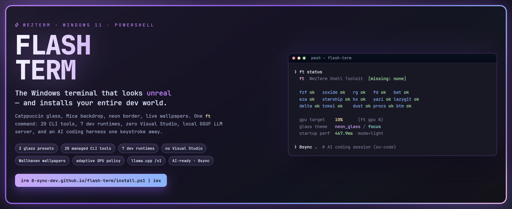
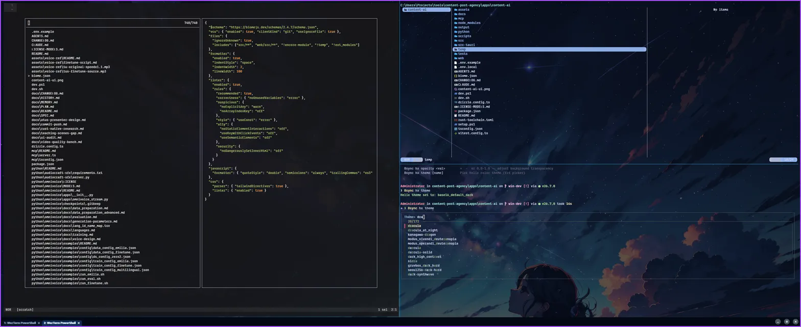
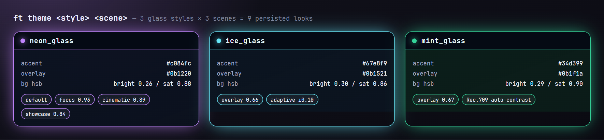
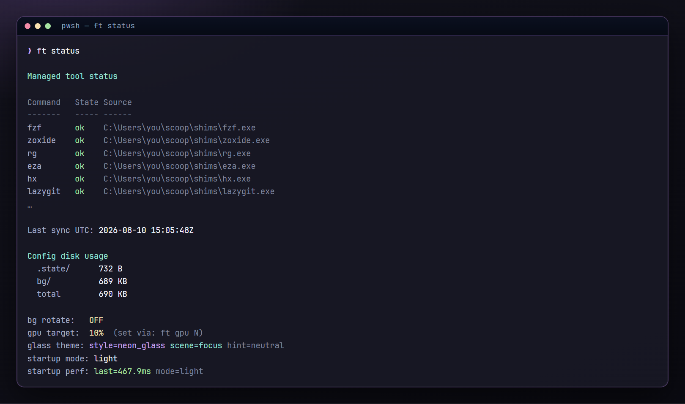
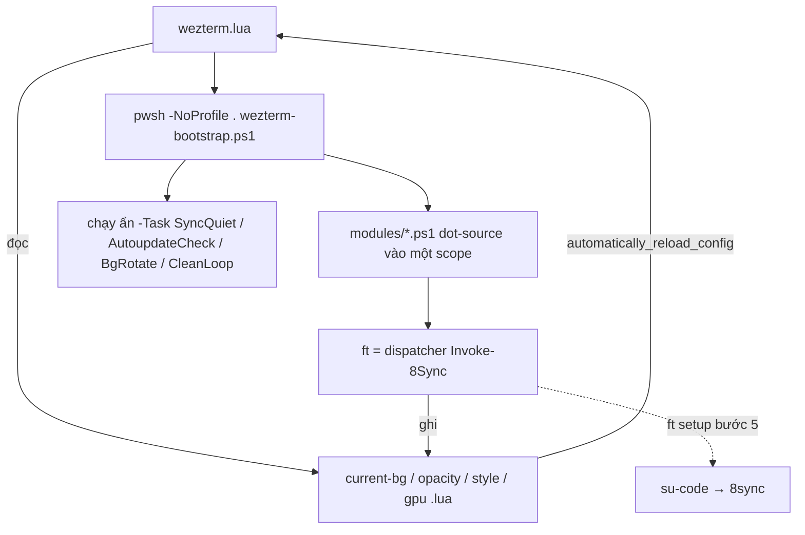

<div align="center">



<h1>⚡ flash-term</h1>

**Terminal Windows 11 đẹp không tưởng — và dựng trọn bộ môi trường dev bằng một câu lệnh.**

Cấu hình WezTerm + lệnh `ft`: kính mờ Catppuccin, wallpaper động, 21 CLI tool, 7 dev runtime
**không cần Visual Studio**, server LLM GGUF chạy local, và AI coding harness cách đúng một tổ hợp phím.

[](https://www.microsoft.com/windows)
[](https://wezfurlong.org/wezterm/)
[](https://learn.microsoft.com/powershell/)
[](https://github.com/catppuccin/catppuccin)
[](#-bộ-công-cụ--21-cli-tool-7-runtime-0-visual-studio)
[](LICENSE)

[English](README.md) · **Tiếng Việt** · [Website](https://8-sync-dev.github.io/flash-term/vi.html) · [Phím tắt](docs/KEYBINDINGS.md) · [Kiến trúc](docs/ARCHITECTURE.md)

```powershell
irm https://8-sync-dev.github.io/flash-term/install.ps1 | iex
```

</div>

---

## Vì sao chọn flash-term

Terminal trên Windows luôn bắt bạn chọn: **đẹp** hoặc **mạnh**. flash-term không chọn — lấy cả hai.

- 🪟 **Đẹp mà vẫn đọc được.** 3 style kính × 3 scene = 9 diện mạo được lưu lại, viền neon 4px,
  nền Mica, và lớp overlay tự đọc độ sáng (Rec.709) của chính wallpaper để chữ không bao giờ bị chìm.
- 🚀 **Một câu lệnh dựng cả máy.** `ft setup` đi từ Windows trắng → Scoop, WezTerm, Nerd Font,
  PowerShell 7, 21 CLI tool, 7 dev runtime, AI harness. **Không cần Visual Studio build tools.**
- 🧠 **Sẵn sàng cho AI, và nói thật về AI.** flash-term không chứa code AI. Nó cài
  [su-code](https://github.com/8-Sync-Dev/su-code) (lệnh `8sync`) và có thể serve model GGUF **của bạn**
  qua endpoint tương thích OpenAI `/v1`.
- ⏱ **Nhanh có chủ đích.** Thời gian khởi động được đo theo từng phase, lưu vòng 40 lượt, và hiện trong
  `ft status` (`startup perf: last=467.9ms`). Cache, cổng chặn, hoãn init prompt — tất cả vì đã đo bằng ms.

<div align="center">



</div>

## ⚡ Cài đặt

**Một dòng** (PowerShell):

```powershell
irm https://8-sync-dev.github.io/flash-term/install.ps1 | iex
```

…hoặc bằng `curl`:

```sh
curl -fsSL https://raw.githubusercontent.com/8-Sync-Dev/flash-term/main/install.ps1 | pwsh -
```

Chạy lại bất cứ lúc nào để **cập nhật** (fetch + hard-reset về `origin/main` — đừng để sửa đổi cá nhân
trong `~/.config/wezterm`, hoặc dùng `ft up self` vì nó tự stash giúp bạn).

| Cờ | Tác dụng |
|---|---|
| `-ConfigDir <path>` | Cài vào chỗ khác `%USERPROFILE%\.config\wezterm` |
| `-Update` | Chỉ pull, bỏ qua `ft setup` |
| `-NoSetup` | Chỉ config — không Scoop, không tool, không runtime |
| `-Branch <name>` / `-Repo <url>` | Theo branch hoặc fork khác |

**Từ source:**

```powershell
git clone https://github.com/8-Sync-Dev/flash-term.git "$env:USERPROFILE\.config\wezterm"
pwsh -NoProfile -Command ". $env:USERPROFILE\.config\wezterm\wezterm-bootstrap.ps1 -Task Status; Invoke-SetupCommand"
```

Trình cài sẽ clone rồi chạy **`ft setup`** — 5 bước có nhãn rõ ràng, bước nào cũng bỏ qua được
(`--no-tools`, `--no-dev`, `--no-harness`, `--check`):

```
[1/5] core tools on PATH        kiểm tra git · omp · wezterm
[2/5] Scoop                     + WezTerm, JetBrainsMono NF, PowerShell 7, CompletionPredictor
[3/5] managed tools             21 CLI tool qua Scoop
[4/5] dev runtimes              node · python · go · rust · chromium · encore · docker
[5/5] AI harness                trình cài su-code → lệnh `8sync`
```

> Docker Desktop cài qua `winget`, cần mở GUI một lần và bật WSL2. Dùng `--no-dev` để bỏ qua bước 4.

## 🎨 Diện mạo

<div align="center">



</div>

```powershell
ft theme                    # style + scene hiện tại
ft theme ice_glass          # đổi style
ft theme neon_glass cinematic
ft hx opacity +             # tăng/giảm overlay wallpaper (bước 0.05)
```

- **Style** (`neon_glass` · `ice_glass` · `mint_glass`) quyết định độ sáng/bão hoà wallpaper, màu overlay,
  màu tab và màu status bar.
- **Scene** (`focus` · `cinematic` · `showcase`) quyết định độ mờ cửa sổ/chữ — `0.93 / 0.89 / 0.84`.
- **Tương phản thích ứng**: Wallhaven trả về palette màu → tính độ sáng Rec.709 (0.2126/0.7152/0.0722)
  → gợi ý `bright` / `neutral` / `dark` → cộng/trừ `adaptive_overlay_strength` cho lớp kính.
- **Viền neon tím**: 4px `#a855f7` cả bốn cạnh, nút title tích hợp, nền Mica, Catppuccin Mocha.
- **Font**: JetBrainsMono NF → NFM → CaskaydiaCove NF Mono → GeistMono NF → Consolas, size 13,
  ligature + `ss01`/`ss02`, render subpixel LCD.
- **Status bar không tạo subprocess**: nhánh git được đọc bằng cách lần `.git/HEAD` ngược lên tối đa 16 cấp
  (detached HEAD → SHA ngắn) — không hề gọi `git.exe` mỗi 1.5 giây. Bảng format tạo một lần, lưu trong
  `wezterm.GLOBAL` rồi sửa tại chỗ.
- **Chịu được file hỏng**: mọi lần đọc state đều bọc `pcall` và kiểm tra kiểu; file lỗi thì về mặc định,
  không bao giờ làm chết terminal. `Ctrl+Shift+b` đổi ảnh ↔ gradient, `Ctrl+Shift+o` xoay 4 kiểu con trỏ.

## 🖼 Wallpaper

```powershell
ft bg search cyberpunk city        # wallhaven (chỉ 4K+)
ft bg search --yandere sakura      # yande.re, rating:safe, width:3840..
ft bg search --safebooru --all neon
ft bg pick                         # fzf + thumbnail chafa ngay trong terminal
ft bg set 3                        # hoặc id, đường dẫn local, hoặc URL
ft bg rotate on 10                 # đổi ảnh trong bg/ mỗi 10 phút
ft bg list --preview               # xem trước bằng imgcat + link nguồn
```

Ba nguồn ảnh, **chỉ SFW theo thiết kế** (Wallhaven `purity=110`, yande.re `rating:safe`, safebooru),
điều kiện 4K nằm sẵn trong mọi truy vấn, cache 50 kết quả, và `ft bg set` copy ảnh bạn chọn vào
`assets/default-bg.jpg` — **wallpaper đi theo config của bạn**.

## 🧰 Lệnh `ft`

| Lệnh | Làm gì |
|---|---|
| `ft help` / `ft status` | Menu đầy đủ (tự wrap theo bề rộng) · tool, disk, GPU, theme, tốc độ khởi động |
| `ft setup [--check\|--no-tools\|--no-dev\|--no-harness]` | Bootstrap 5 bước |
| `ft sync [--check]` | Cài thiếu + `scoop update` toàn bộ tool (có lock, gộp batch) |
| `ft up [self\|scoop\|sucode\|wezterm] [--check]` | Update-all: pull ff-only (tự stash), tool Scoop, binary AI su-code, phiên bản WezTerm |
| `ft reload` | Nạp lại 14 module vào shell **đang chạy** — không cần tab mới |
| `ft dev [name\|all] [--check]` | Dựng dev runtime |
| `ft autoupdate [on\|off\|auto\|now]` | Nền: kiểm tra cập nhật + release (mỗi 6 giờ) |
| `ft clean [--days N\|--dry-run\|--envs\|--projects\|--deep\|--scan\|--audit\|--loop]` | Dọn ổ đĩa, audit chuỗi phụ thuộc |
| `ft theme [style] [scene]` · `ft gpu [N\|status\|auto\|off]` | Diện mạo kính · chính sách GPU/FPS |
| `ft bg …` | Wallpaper: search / pick / set / rotate / list / remove |
| `ft hx lang\|health\|theme\|bg\|wrap\|opacity` | Tích hợp Helix |
| `ft gguf serve\|chat\|list\|info\|presets\|profiles\|detect\|hint\|save\|status\|stop` | Server llama.cpp local |
| `ft profile list\|create\|clone\|switch\|open\|delete` | Profile terminal tách biệt kiểu Chrome |

Tab completion phủ 15 lệnh và 10 nhóm con (kể cả mọi cờ của `gguf`). Kèm alias:
`ll` `lt` `y` `catn` `ff` `cdi` `mkcd` `e` `lg` `pss` `top` `du` — và **`fix`**, phát 9 escape sequence
(mouse tracking, bracketed paste, alt-screen, con trỏ, SGR) để cứu terminal bị một TUI crash làm treo.

## 🛠 Bộ công cụ — 21 CLI tool, 7 runtime, 0 Visual Studio

<div align="center">



</div>

**CLI tool được quản lý** (`ft sync`, tất cả qua Scoop):
`fzf` · `zoxide` · `ripgrep` · `fd` · `bat` · `eza` · `starship` · `helix` · `yazi` · `lazygit` · `delta` ·
`tokei` · `hyperfine` · `dust` · `procs` · `bottom` · `less` · `jq` · `yq` · `make` · `chafa`

**Dev runtime** (`ft dev all`):

| Runtime | Cách cài | Vì sao không cần MSVC |
|---|---|---|
| Node.js + npm + pnpm | Scoop `nodejs` + `corepack enable` | bản build sẵn |
| Python | Scoop `uv` → `uv python install` | CPython standalone build sẵn, không biên dịch |
| Go | Scoop `go` | bản build sẵn |
| **Rust** | Scoop `gcc` + `rustup` → `rustup default stable-x86_64-pc-windows-gnu` | **linker MinGW thay cho `link.exe`** |
| Chromium | Scoop `extras/chromium` | bản build sẵn |
| Encore.dev | script cài chính thức | bản build sẵn |
| Docker Desktop | `winget` | cần admin + WSL2 + mở GUI một lần |

Mỗi chuỗi cài khai báo `Test` / `Version` / `PostInstall`, nên chạy lại sẽ không cài gì thêm; PATH và cache
lệnh được refresh ngay trong process — tool mới dùng được ngay ở tab **hiện tại**.

## 🧠 LLM local + AI coding

flash-term lo phần serve model; **[su-code](https://github.com/8-Sync-Dev/su-code)** lo phần suy nghĩ.

```powershell
ft gguf hint                                    # checklist driver / CUDA / llama.cpp
ft gguf serve --engine-path <dir> --model-path <model.gguf> --balance
ft gguf list                                    # health, tok/s từ /metrics, ctx, uptime
ft gguf chat --model-path <model.gguf>          # chat nhiều lượt không cần server
```

`--balance` là bộ giải VRAM thật, không phải preset đổi tên: kích thước model → ước lượng số layer
(80/60/40/32/28/22), hệ số quant từ tên file (`Q8_0|F16` 2.0 → `Q2_K|IQ1` 0.5), đọc `nvidia-smi memory.free`
trực tiếp, chừa `300MB + min(500, params×10)`, **giảm 20% GPU layer khi GPU trên 75 °C**, bật flash-attention
chỉ khi offload toàn bộ, và nâng context 8K → 16K → 32K → 64K theo VRAM còn lại.

| Preset | GPU layer | Thread | Context | Parallel | Batch | Flash-attn |
|---|---|---|---|---|---|---|
| `max` | 99 | 2 | 32768 | 4 | 512 | ✅ |
| `high` | 32 | 4 | 16384 | 2 | 256 | ✅ |
| `medium` | 16 | 8 | 8192 | 1 | 128 | — |
| `low` | 0 (CPU) | 16 | 4096 | 1 | 64 | — |

Server luôn được thêm `--metrics --jinja --cont-batching --cache-type-k q8_0 -ub 512` và mở
`http://localhost:8080/v1`. Trỏ bất kỳ client tương thích OpenAI vào đó — kể cả `8sync`
(xem [docs/gguf-local-gpu-provider.md](docs/gguf-local-gpu-provider.md)).

> ⚠️ Mặc định endpoint bind `0.0.0.0` và **không có auth**. Trên mạng dùng chung hãy thêm `--host 127.0.0.1`.

**AI coding** (`ft setup` cài sẵn, hoặc `irm https://8-sync-dev.github.io/su-code/install.ps1 | iex`):

```powershell
8sync setup          # cài AI core (omp + skills), một lần
8sync .              # mở / tiếp tục session trong repo này
```

Phím leader gõ hộ bạn: `Ctrl+a .` → `8sync .`, `Ctrl+a o` → `8sync ai `,
`Ctrl+a h` → `8sync harness status`, `Ctrl+a k` → `8sync skill list`.

## 🧹 Dọn dẹp mà không ăn mất code

```powershell
ft clean --dry-run          # nên xem trước
ft clean --days 14          # chỉ file cũ hơn 14 ngày
ft clean --audit            # npm audit + quét postinstall độc hại + cargo audit + pip-audit
ft clean --deep             # báo cáo rác npx/npm/pip/cargo/go
ft clean --projects         # báo cáo repo git ít dùng (chỉ báo cáo, theo thiết kế)
ft clean --loop on 15 balanced
```

- **Hơn 50 mục tiêu liệt kê rõ**: TEMP ×4, 6 cache trình duyệt, 17 cache công cụ dev, 8 cache app chat/media,
  19 cache Windows, `go clean -cache`/`-modcache`, `docker system prune -f` (đọc dung lượng thu hồi từ stdout),
  GC + trim working set, xả DNS/ARP/NetBIOS, `ReTrim` cho SSD / `Defrag` cho HDD.
- **Ba lớp bảo vệ độc lập**, kiểm tra lại ngay trước mỗi lần xoá: dò tổ tiên tìm
  `.git`/`package.json`/`Cargo.toml`/`go.mod`/`pyproject.toml`/`*.sln`…, phát hiện git worktree, và luật cứng
  là `--projects` **không được xoá**. `node_modules`, `target/`, `vendor/` không bao giờ bị chạm.
- **Bộ quét nhanh**: `Directory.EnumerateFiles` với `AllDirectories` (không dùng `Get-ChildItem -Recurse`),
  spinner vẽ lại mỗi 500 file, thư mục rỗng dọn từ dưới lên.
- **Vòng lặp nền không gây hại**: profile `light` (5 phút/nghỉ 720 phút) · `balanced` (15/360) ·
  `deep` (45/180 + quét nhanh Defender); lock theo PID tự phá sau 180 phút; xoá file trong mỗi lượt
  **luôn** là dry-run; bỏ quét Defender khi `MsMpEng` vượt 700 MB.

> `ft clean` không kèm cờ sẽ **xoá thật** (file cũ hơn 7 ngày). Hãy chạy `--dry-run` trước.

## 👤 Profile terminal

```powershell
ft profile create work
ft profile clone default demo
ft profile open work         # cửa sổ mới: riêng .state, riêng wallpaper/theme/GPU, riêng config CLI
ft profile switch work       # chỉ tab hiện tại (state + env, dùng chung diện mạo)
```

Mỗi profile có `.state/profiles/<name>/`, bộ `current-{bg,opacity,style,gpu}-<name>.lua` riêng và
`CLAUDE_CONFIG_DIR` riêng — như một danh tính thứ hai trong một cửa sổ thứ hai.

## ⌨️ Phím tắt (trích)

| Hành động | Phím |
|---|---|
| Leader | `Ctrl+a` (900ms) |
| Chia pane phải / dưới | `Ctrl+Shift+\|` / `Ctrl+Shift+_` |
| Di chuyển / resize pane | `Ctrl+Shift+Arrow` / `Alt+Shift+Arrow` |
| Tab | `Ctrl+Tab` · `Alt+1..9` · `Alt+0` (tab cuối) |
| Đổi wallpaper ↔ gradient | `Ctrl+Shift+b` |
| Xoay kiểu con trỏ | `Ctrl+Shift+o` |
| Lưu phiên / khôi phục phiên (fuzzy) | `Ctrl+a Shift+s` / `Ctrl+a Shift+r` |
| Command palette / launcher | `Ctrl+Shift+p` / `Ctrl+Shift+l` |
| Lịch sử fuzzy (fzf) / nhảy thư mục (zoxide) | `Ctrl+r` / `Alt+c` |
| Reload config / copy mode | `Ctrl+a r` / `Ctrl+a c` |
| Dán ảnh (lưu file + điền đường dẫn) | `Ctrl+Alt+v` |

Bảng đầy đủ: [docs/KEYBINDINGS.md](docs/KEYBINDINGS.md).

## 🏗 Kiến trúc



PowerShell không gọi API của WezTerm: nó ghi bốn file Lua nhỏ, và `automatically_reload_config` tự áp dụng.
Biến môi trường thắng file state; biến thể theo profile thắng cả hai. Việc chạy nền tái nhập chính
bootstrap dưới dạng process `pwsh -Task …` ẩn, nên mở tab không bao giờ phải chờ mạng.

```
wezterm.lua · keys.lua          cấu hình WezTerm (854 + 86 dòng)
wezterm-bootstrap.ps1           bootstrap shell, toàn bộ biến $script:, các entry -Task
install.ps1                     trình cài/cập nhật một dòng (git + fallback zipball)
modules/                        bộ lệnh ft
  core · shell · startup        menu, completer, dispatcher, alias, đo khởi động
  sync · up · setup · dev       tool, update-all, bootstrap, runtime
  bg · theme · gpu · helix      wallpaper, kính, chính sách GPU, Helix
  clean · profile · gguf        dọn dẹp + audit, profile, model local
  autoupdate                    thông báo cập nhật nền
gguf-config/                    preset + profile llama.cpp
docs/                           ARCHITECTURE · KEYBINDINGS · gguf-local-gpu-provider
```

## ✅ Yêu cầu & lưu ý thật lòng

- **Windows 10/11 + PowerShell 5.1+** (PowerShell 7 do `ft setup` cài). Có dùng Scoop và `winget`;
  cài Scoop và TRIM/defrag ổ đĩa cần quyền admin.
- **JetBrainsMono Nerd Font** được dò 4 cách và do `ft setup` cài; thiếu font thì glyph trên status bar
  sẽ thành ô vuông.
- `ft gpu N` là **chính sách hai trạng thái**, không phải sàn mức dùng GPU: `≥10` → HighPerformance + 165 FPS,
  `<10` → LowPower + 120. Việc chọn adapter (rời → tích hợp → fallback OpenGL) nằm ở phía Lua.
- **Mica** đã bật, nhưng wallpaper kèm overlay nằm trên nó; độ trong bạn thấy phần lớn đến từ
  `window_background_opacity`. Không có tuỳ chọn acrylic/blur.
- **Đổi wallpaper và vòng dọn dẹp là poll khi mở shell**, không phải Task Scheduler của Windows — cửa sổ
  để yên sẽ không tự đổi ảnh.
- Thumbnail của `ft bg pick` cần `chafa` (đã nằm trong danh sách tool) và `curl.exe` (Windows có sẵn).
- `ft autoupdate` cần bản checkout git; cài bằng ZIP sẽ không có thông báo.
- **Không cấu hình domain WSL/SSH**, và flash-term **không chứa code AI** — đó là việc của `su-code`.

## 📚 Tài liệu

- [docs/ARCHITECTURE.md](docs/ARCHITECTURE.md) — luồng cấu hình, hợp đồng state, bản đồ module
- [docs/KEYBINDINGS.md](docs/KEYBINDINGS.md) — mọi phím tắt, kể cả chuột
- [docs/gguf-local-gpu-provider.md](docs/gguf-local-gpu-provider.md) — serve model GGUF cho `8sync`
- [CHANGELOG.md](CHANGELOG.md) · [AGENTS.md](AGENTS.md) (hướng dẫn cho người đóng góp + agent)

## 🤝 Đóng góp

Không có build system. Kiểm tra thay đổi bằng:

```powershell
Get-ChildItem -Recurse -Include *.ps1 modules | ForEach-Object {
  $e = $null
  $null = [System.Management.Automation.Language.Parser]::ParseFile($_.FullName, [ref]$null, [ref]$e)
  if ($e.Count) { $_.Name; $e }
}
pwsh -NoProfile -ExecutionPolicy Bypass -File .\wezterm-bootstrap.ps1 -Task Hint
wezterm --config-file .\wezterm.lua --version
```

Sau đó chạy thử lệnh `ft` liên quan trong một `pwsh` mới. Thêm lệnh mới? Theo checklist 5 bước trong
[AGENTS.md](AGENTS.md).

## 📄 Giấy phép

[MIT](LICENSE) © 8-Sync-Dev

---

<div align="center">

**Từ khoá** — windows terminal · wezterm config · tuỳ biến terminal windows 11 · catppuccin mocha ·
powershell profile · terminal kính mờ · mica acrylic · nerd font · scoop · dựng môi trường dev windows ·
rust không cần visual studio · uv python windows · llama.cpp windows · gguf local llm ·
endpoint tương thích openai · ai coding cli · wallpaper terminal · fzf zoxide ripgrep eza ·
helix editor windows · dotfiles windows

`#windows11` `#wezterm` `#terminal` `#powershell` `#catppuccin` `#dotfiles` `#devtools` `#cli`
`#scoop` `#nerdfonts` `#rustlang` `#golang` `#nodejs` `#python` `#llamacpp` `#gguf` `#localllm`
`#aicoding` `#developerexperience` `#ricing`

⭐ **Thả star nếu terminal của bạn vừa đẹp lên.** · [Báo lỗi](https://github.com/8-Sync-Dev/flash-term/issues) · [su-code (AI harness)](https://github.com/8-Sync-Dev/su-code)

</div>
