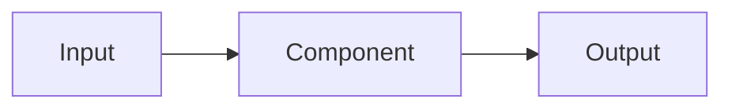

# <Paper Title — concise, specific, no hype>

*<Author Name>*, *<Affiliation>* — *<email>*

> ✍️ This is the render-safe IEEE Markdown skeleton. Copy it to `papers/<name>.md`, replace
> every `<…>` and `✍️` guidance line, then render with
> `scripts/render_paper.sh papers/<name>.md papers academic <pages>`. Keep the `## I.` style
> section numbering. Delete these guidance blockquotes before rendering.

## Abstract

> ✍️ 150–250 words, self-contained, **no citations**. State problem, approach, key result,
> and contribution. A reader should grasp the whole paper from this alone.

<Abstract text.>

**Index Terms** — <term one>, <term two>, <term three>, <term four>.

## I. Introduction

> ✍️ Motivate the problem, state the gap, list contributions as bullets, end with a paper map.
> Cite prior context with `[n]`.

<Context and motivation, grounded in the literature [1].> The gap this work addresses is
<gap> [2]. Our contributions are:

- <Contribution 1.>
- <Contribution 2.>
- <Contribution 3.>

The remainder of this paper is organized as follows. Section II reviews related work;
Section III presents the <method/system>; Section IV reports results; Sections V–VI discuss
and conclude.

## II. Related Work

> ✍️ Group by theme (2–4 subsections). Every borrowed claim gets a `[n]`. This is where most
> citations live — position your work against the state of the art.

### A. <Theme one>

### B. <Theme two>

## III. Method / System

> ✍️ Mode B: describe the system that exists (cite repo modules by name). Mode A: describe the
> *proposed* approach + methodology. Use a figure and equations where they clarify.

<Design overview.> Figure 1 shows the architecture.

**Fig. 1.** <One-line caption describing the architecture.>

The core relationship is

$$ y = f(x;\theta) $$

where <define symbols>.

## IV. Experiments / Results

> ✍️ Mode B: real setup, metrics, and numbers (be honest — report limitations). Mode A: the
> evaluation *plan* (datasets, baselines, metrics, success criteria).

**TABLE I.** <Caption above the table.>

| Method | Metric A | Metric B |
|--------|----------|----------|
| Baseline [3] | <val> | <val> |
| Ours | <val> | <val> |

<Analysis of the numbers, referencing prior results [3].>

## V. Discussion

> ✍️ Interpret the results, name tradeoffs, threats to validity, and limitations honestly.

<Discussion.>

## VI. Conclusion

> ✍️ Restate the contribution and one concrete future-work direction. No new citations.

<Conclusion and future work.>

## References

> ✍️ IEEE numeric, **order of appearance**, real metadata only (see `ieee-format.md §2`).
> The three below are correctly-formatted real examples — replace with your resolved sources.

[1] IEEE, *IEEE Reference Guide*. Piscataway, NJ, USA: IEEE, 2023. [Online]. Available: https://journals.ieeeauthorcenter.ieee.org/

[2] A. Vaswani et al., "Attention is all you need," in *Proc. NeurIPS*, Long Beach, CA, USA, 2017, pp. 5998–6008.

[3] K. Shoair, "Scrapling: adaptive, high-performance web scraping for Python," GitHub. https://github.com/D4Vinci/Scrapling (accessed Jul. 3, 2026).
